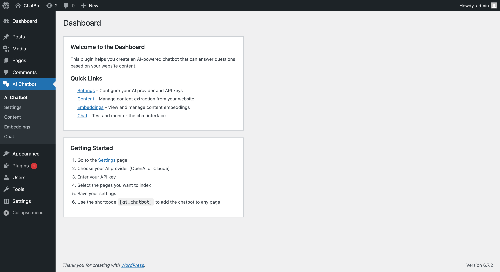
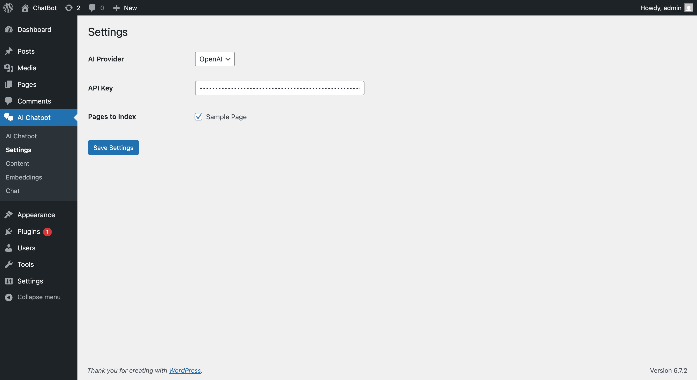
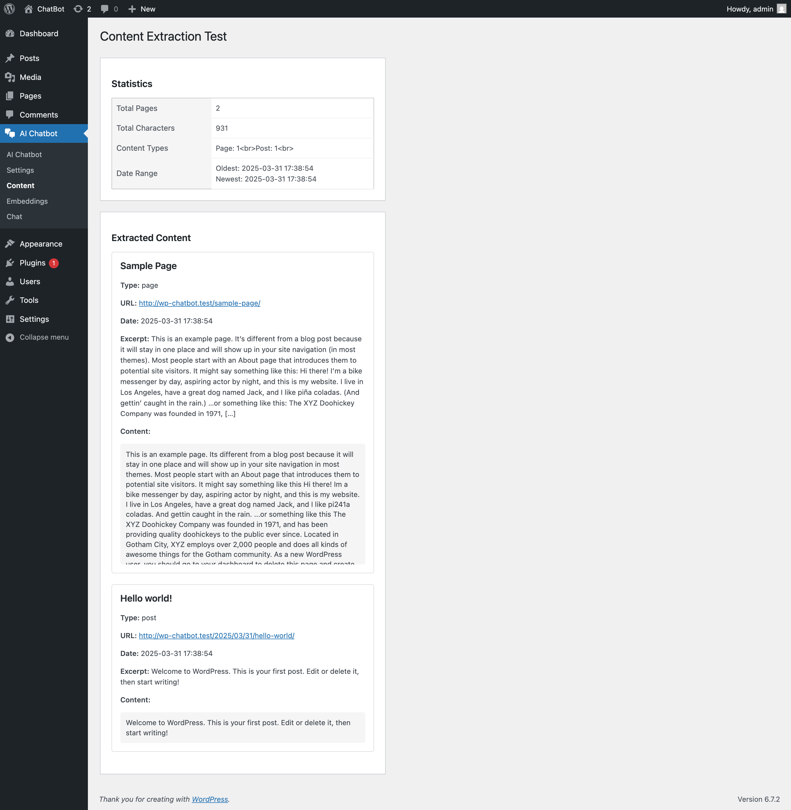
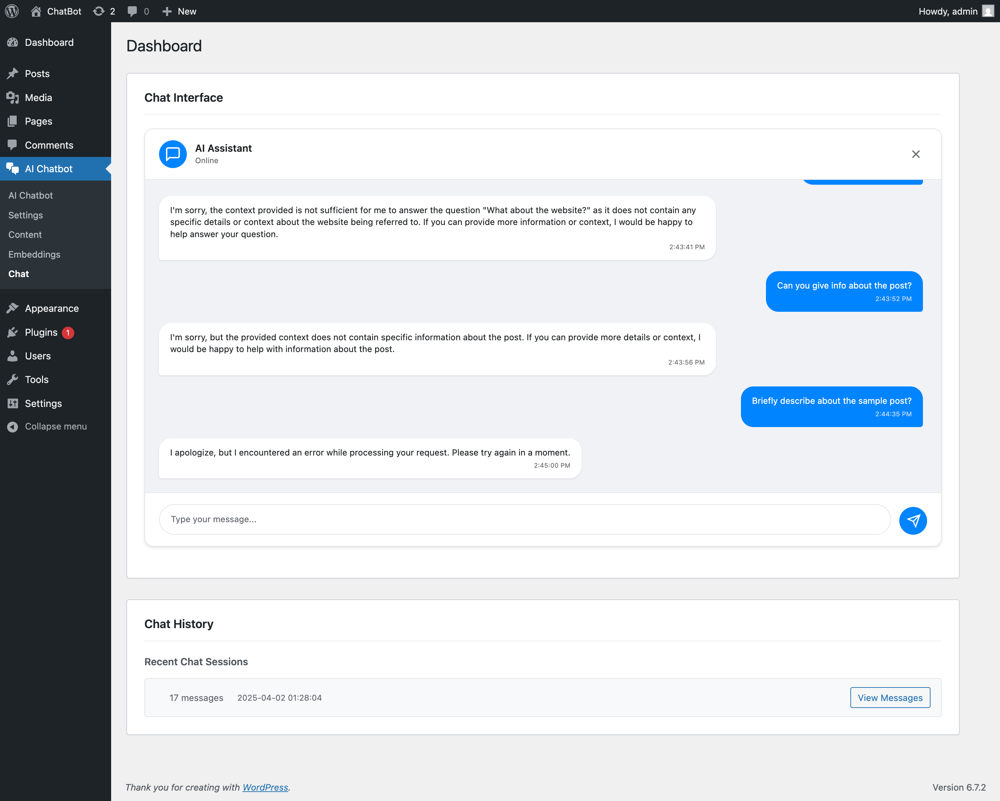
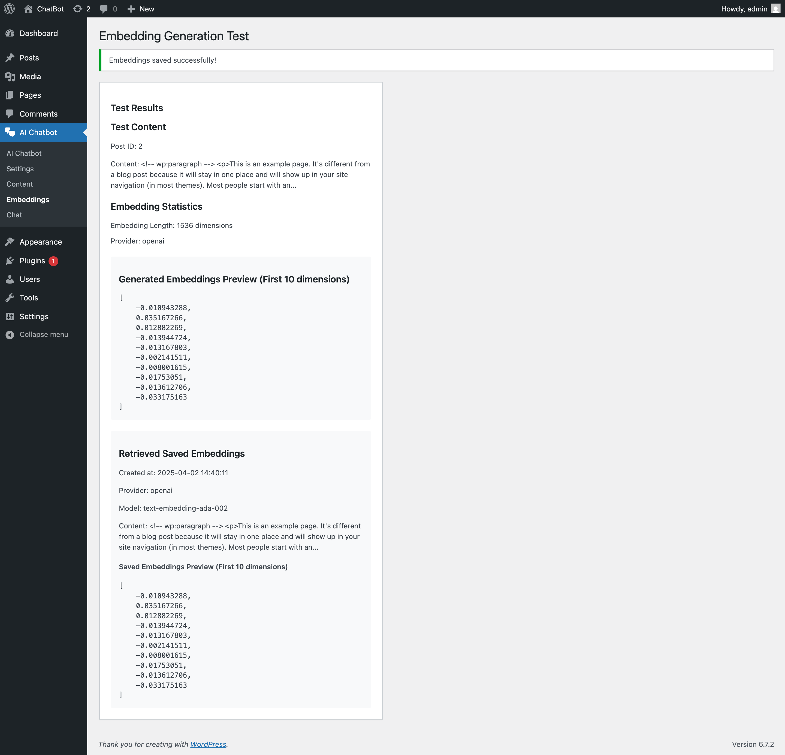

# WordPress AI Chatbot

A powerful AI-powered chatbot plugin for WordPress that can intelligently answer questions based on your website content.

## Features

- 🤖 AI-powered responses using OpenAI or Claude
- 📚 Content extraction from WordPress pages
- 🔍 Vector search for relevant content
- 💬 Modern chat interface
- 📱 Responsive design
- 🔒 Secure API key management
- 📊 Chat history tracking
- 🌐 Public/private access control

## Screenshots

<table>
  <tr>
    <td></td>
    <td></td>
  </tr>
  <tr>
    <td></td>
    <td></td>
  </tr>
  <tr>
    <td colspan="2"></td>
  </tr>
</table>

## Technologies Used

- **Backend:**

  - PHP 7.4+
  - WordPress Plugin Architecture
  - OpenAI API / Claude API
  - MySQL/MariaDB

- **Frontend:**
  - React.js
  - TypeScript
  - TailwindCSS
  - React Context for state management

## Project Setup

### Prerequisites

- WordPress 5.8 or higher
- PHP 7.4 or higher
- MySQL 5.6 or higher
- Node.js 14+ (for frontend development)

### Installation

1. Clone the repository:

```bash
git clone https://github.com/zrshishir/wp-ai-chatbot.git
cd wp-ai-chatbot
```

2. Install PHP dependencies:

```bash
composer install
```

3. Install frontend dependencies:

```bash
cd src/frontend
npm install
```

4. Build the frontend:

```bash
npm run build
```

5. Copy the plugin to your WordPress plugins directory:

```bash
cp -r wp-ai-chatbot /path/to/wordpress/wp-content/plugins/
```

6. Activate the plugin through WordPress admin panel

### Configuration

1. Go to WordPress admin panel → Dashboard → Settings
2. Enter your OpenAI or Claude API key
3. Select the pages you want to index
4. Configure other settings as needed

## Content Extraction and Processing

### How It Works

1. **Content Extraction:**

   - The plugin scans selected WordPress pages
   - Extracts text content, titles, and metadata
   - Cleans HTML and removes unnecessary elements
   - Preserves important formatting and structure

2. **Content Processing:**

   - Text is chunked into manageable segments
   - Each segment is processed for embedding generation
   - Embeddings are stored in the database for quick retrieval

3. **Vector Search:**
   - User queries are converted to embeddings
   - Similar content is retrieved using vector similarity
   - Most relevant content is used for context

### Database Structure

```sql
-- Chat Sessions Table
CREATE TABLE wp_aicb_chat_sessions (
    id BIGINT UNSIGNED AUTO_INCREMENT PRIMARY KEY,
    session_id VARCHAR(255) NOT NULL,
    user_id BIGINT UNSIGNED,
    created_at TIMESTAMP DEFAULT CURRENT_TIMESTAMP,
    updated_at TIMESTAMP DEFAULT CURRENT_TIMESTAMP ON UPDATE CURRENT_TIMESTAMP
);

-- Chat Messages Table
CREATE TABLE wp_aicb_chat_messages (
    id BIGINT UNSIGNED AUTO_INCREMENT PRIMARY KEY,
    session_id VARCHAR(255) NOT NULL,
    role ENUM('user', 'assistant') NOT NULL,
    content TEXT NOT NULL,
    created_at TIMESTAMP DEFAULT CURRENT_TIMESTAMP
);

-- Embeddings Table
CREATE TABLE wp_aicb_embeddings (
    id BIGINT UNSIGNED AUTO_INCREMENT PRIMARY KEY,
    content TEXT NOT NULL,
    embedding LONGTEXT NOT NULL,
    created_at TIMESTAMP DEFAULT CURRENT_TIMESTAMP
);
```

## Prompt Engineering

### Approach

1. **Context Building:**

   - Retrieve relevant content using vector search
   - Format content into clear, concise context
   - Include metadata and source information

2. **System Prompt:**

   ```text
   You are a helpful AI assistant for [website name].
   Use the following context to answer questions:
   [Relevant content]

   Guidelines:
   - Be concise and accurate
   - Cite sources when possible
   - Acknowledge limitations
   ```

3. **User Query Processing:**
   - Clean and normalize user input
   - Extract key concepts for context matching
   - Format query for optimal AI processing

## Frontend Implementation

### React Components

```typescript
// src/frontend/components/ChatContainer.tsx
interface ChatContainerProps {
  messages: Message[];
  onSendMessage: (message: string) => void;
  isLoading: boolean;
}

const ChatContainer: React.FC<ChatContainerProps> = ({ messages, onSendMessage, isLoading }) => {
  // Component implementation
};
```

### State Management

```typescript
// src/frontend/context/ChatContext.tsx
interface ChatContextType {
  messages: Message[];
  isLoading: boolean;
  sendMessage: (message: string) => Promise<void>;
}

const ChatContext = createContext<ChatContextType | undefined>(undefined);
```

### Error Handling

```typescript
// src/frontend/hooks/useChat.ts
const useChat = () => {
  const [error, setError] = useState<Error | null>(null);

  const handleError = (error: Error) => {
    setError(error);
    // Log error to analytics
    // Show user-friendly error message
  };
};
```

## Challenges and Solutions

1. **Challenge: Content Processing**

   - Problem: Large pages with complex HTML
   - Solution: Implemented HTML cleaning and smart chunking

2. **Challenge: API Response Time**

   - Problem: Slow AI responses
   - Solution: Added caching and optimized context retrieval

3. **Challenge: State Management**

   - Problem: Complex chat state
   - Solution: Implemented React Context with proper typing

4. **Challenge: Error Handling**
   - Problem: Various failure points
   - Solution: Comprehensive error handling and user feedback

## Technical Specifications

### Frontend Requirements

1. **React Implementation:**

   - Use functional components
   - Implement proper TypeScript types
   - Follow React best practices

2. **State Management:**

   - Use React Context for global state
   - Implement proper loading states
   - Handle error states gracefully

3. **UI/UX:**

   - Clean, modern design
   - Responsive layout
   - Loading indicators
   - Error messages
   - Smooth animations

4. **Code Quality:**
   - Comprehensive comments
   - TypeScript types
   - ESLint configuration
   - Prettier formatting

### Backend Requirements

1. **API Endpoints:**

   - RESTful design
   - Proper authentication
   - Rate limiting
   - Error handling

2. **Database:**

   - Optimized queries
   - Proper indexing
   - Transaction handling

3. **Security:**
   - API key encryption
   - Input sanitization
   - XSS prevention
   - CSRF protection

## Contributing

1. Fork the repository
2. Create your feature branch
3. Commit your changes
4. Push to the branch
5. Create a Pull Request

## License

This project is licensed under the GPL v2 or later - see the [LICENSE](LICENSE) file for details.

## Credits

This project was initially scaffolded using the [WordPress Plugin Boilerplate](https://github.com/prappo/wordpress-plugin-boilerplate) by Prappo. Many thanks to the contributors of that project for providing a solid foundation for building WordPress plugins.
