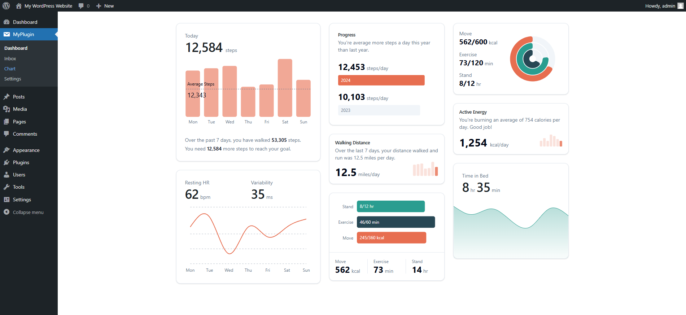

# WordPress AI Chatbot

A powerful AI-powered chatbot plugin for WordPress that can intelligently answer questions based on your website content.

## Features

- 🤖 AI-powered responses using OpenAI or Claude
- 📚 Content extraction from WordPress pages
- 🔍 Vector search for relevant content
- 💬 Modern chat interface
- 📱 Responsive design
- 🔒 Secure API key management
- 📊 Chat history tracking
- 🌐 Public/private access control

## Screenshots

<table>
  <tr>
    <td></td>
    <td></td>
  </tr>
  <tr>
    <td></td>
    <td></td>
  </tr>
  <tr>
    <td colspan="2"></td>
  </tr>
</table>

## Technologies Used

- **Backend:**

  - PHP 7.4+
  - WordPress Plugin Architecture
  - OpenAI API / Claude API
  - MySQL/MariaDB

- **Frontend:**
  - React.js
  - TypeScript
  - TailwindCSS
  - React Context for state management

## Project Setup

### Prerequisites

- WordPress 5.8 or higher
- PHP 7.4 or higher
- MySQL 5.6 or higher
- Node.js 14+ (for frontend development)

### Installation

1. Clone the repository:

```bash
git clone https://github.com/yourusername/wp-ai-chatbot.git
cd wp-ai-chatbot
```

2. Install PHP dependencies:

```bash
composer install
```

3. Install frontend dependencies:

```bash
cd src/frontend
npm install
```

4. Build the frontend:

```bash
npm run build
```

5. Copy the plugin to your WordPress plugins directory:

```bash
cp -r wp-ai-chatbot /path/to/wordpress/wp-content/plugins/
```

6. Activate the plugin through WordPress admin panel

### Configuration

1. Go to WordPress admin panel → Dashboard → Settings
2. Enter your OpenAI or Claude API key
3. Select the pages you want to index
4. Configure other settings as needed

## Content Extraction and Processing

### How It Works

1. **Content Extraction:**

   - The plugin scans selected WordPress pages
   - Extracts text content, titles, and metadata
   - Cleans HTML and removes unnecessary elements
   - Preserves important formatting and structure

2. **Content Processing:**

   - Text is chunked into manageable segments
   - Each segment is processed for embedding generation
   - Embeddings are stored in the database for quick retrieval

3. **Vector Search:**
   - User queries are converted to embeddings
   - Similar content is retrieved using vector similarity
   - Most relevant content is used for context

### Database Structure

```sql
-- Chat Sessions Table
CREATE TABLE wp_aicb_chat_sessions (
    id BIGINT UNSIGNED AUTO_INCREMENT PRIMARY KEY,
    session_id VARCHAR(255) NOT NULL,
    user_id BIGINT UNSIGNED,
    created_at TIMESTAMP DEFAULT CURRENT_TIMESTAMP,
    updated_at TIMESTAMP DEFAULT CURRENT_TIMESTAMP ON UPDATE CURRENT_TIMESTAMP
);

-- Chat Messages Table
CREATE TABLE wp_aicb_chat_messages (
    id BIGINT UNSIGNED AUTO_INCREMENT PRIMARY KEY,
    session_id VARCHAR(255) NOT NULL,
    role ENUM('user', 'assistant') NOT NULL,
    content TEXT NOT NULL,
    created_at TIMESTAMP DEFAULT CURRENT_TIMESTAMP
);

-- Embeddings Table
CREATE TABLE wp_aicb_embeddings (
    id BIGINT UNSIGNED AUTO_INCREMENT PRIMARY KEY,
    content TEXT NOT NULL,
    embedding LONGTEXT NOT NULL,
    created_at TIMESTAMP DEFAULT CURRENT_TIMESTAMP
);
```

## Prompt Engineering

### Approach

1. **Context Building:**

   - Retrieve relevant content using vector search
   - Format content into clear, concise context
   - Include metadata and source information

2. **System Prompt:**

   ```text
   You are a helpful AI assistant for [website name].
   Use the following context to answer questions:
   [Relevant content]

   Guidelines:
   - Be concise and accurate
   - Cite sources when possible
   - Acknowledge limitations
   ```

3. **User Query Processing:**
   - Clean and normalize user input
   - Extract key concepts for context matching
   - Format query for optimal AI processing

## Frontend Implementation

### React Components

```typescript
// src/frontend/components/ChatContainer.tsx
interface ChatContainerProps {
  messages: Message[];
  onSendMessage: (message: string) => void;
  isLoading: boolean;
}

const ChatContainer: React.FC<ChatContainerProps> = ({ messages, onSendMessage, isLoading }) => {
  // Component implementation
};
```

### State Management

```typescript
// src/frontend/context/ChatContext.tsx
interface ChatContextType {
  messages: Message[];
  isLoading: boolean;
  sendMessage: (message: string) => Promise<void>;
}

const ChatContext = createContext<ChatContextType | undefined>(undefined);
```

### Error Handling

```typescript
// src/frontend/hooks/useChat.ts
const useChat = () => {
  const [error, setError] = useState<Error | null>(null);

  const handleError = (error: Error) => {
    setError(error);
    // Log error to analytics
    // Show user-friendly error message
  };
};
```

## Challenges and Solutions

1. **Challenge: Content Processing**

   - Problem: Large pages with complex HTML
   - Solution: Implemented HTML cleaning and smart chunking

2. **Challenge: API Response Time**

   - Problem: Slow AI responses
   - Solution: Added caching and optimized context retrieval

3. **Challenge: State Management**

   - Problem: Complex chat state
   - Solution: Implemented React Context with proper typing

4. **Challenge: Error Handling**
   - Problem: Various failure points
   - Solution: Comprehensive error handling and user feedback

## Technical Specifications

### Frontend Requirements

1. **React Implementation:**

   - Use functional components
   - Implement proper TypeScript types
   - Follow React best practices

2. **State Management:**

   - Use React Context for global state
   - Implement proper loading states
   - Handle error states gracefully

3. **UI/UX:**

   - Clean, modern design
   - Responsive layout
   - Loading indicators
   - Error messages
   - Smooth animations

4. **Code Quality:**
   - Comprehensive comments
   - TypeScript types
   - ESLint configuration
   - Prettier formatting

### Backend Requirements

1. **API Endpoints:**

   - RESTful design
   - Proper authentication
   - Rate limiting
   - Error handling

2. **Database:**

   - Optimized queries
   - Proper indexing
   - Transaction handling

3. **Security:**
   - API key encryption
   - Input sanitization
   - XSS prevention
   - CSRF protection

## Contributing

1. Fork the repository
2. Create your feature branch
3. Commit your changes
4. Push to the branch
5. Create a Pull Request

## License

This project is licensed under the GPL v2 or later - see the [LICENSE](LICENSE) file for details.

# WordPress Plugin Boilerplate

#### Create your WordPress plugin in weeks, not months. Rapidly prototype and deliver your plugin with confidence!

#### This boilerplate has built-in marketing site and documentation setup which you can use to showcase your plugin.

## Preview

<a href='https://prappo.github.io/wordpress-plugin-boilerplate/preview' target="_blank"></a>

### Screenshots

<table>
 
  <tr>
  <td></td>
  <td></td>
  </tr>
  <tr>
    <td></td>
    <td></td>
    
  </tr>
  
</table>

## Get Started

The plugin consists of two main components: the frontend, built with React, and the backend, which communicates via an API.

To get started, you need to clone the repository and install the dependencies. Then you can rename the plugin and start development. It's that simple!


## Clone the repository

```bash
git clone https://github.com/prappo/wordpress-plugin-boilerplate.git
```

## Install dependencies

```bash
npm install
composer install
```

## Plugin renaming

You can easly rename the plugin by changing data in `plugin-config.json` file.

```json
{
  "plugin_name": "WordPress Plugin Boilerplate",
  "plugin_description": "A boilerplate for WordPress plugins.",
  "plugin_version": "1.0.0",
  "plugin_file_name": "wordpress-plugin-boilerplate.php",
  "author_name": "Prappo",
  "author_uri": "https://prappo.github.io",
  "text_domain": "wordpress-plugin-boilerplate",
  "domain_path": "/languages",
  "main_class_name": "WordPressPluginBoilerplate",
  "main_function_name": "wordpress_plugin_boilerplate_init",
  "namespace": "WordPressPluginBoilerplate",
  "plugin_prefix": "wpb",
  "constant_prefix": "WPB"
}
```

Then run the following command to rename the plugin

```bash
npm run rename
```

## Add Shadcn UI

```bash
npx shadcn@latest add accordion
```

It will install the component in `src/components` folder.

## Structure

<details open>
  <summary><strong>📂 wordpress-plugin-boilerplate</strong></summary>
  <ul>
    <li>
    <details>
    <summary><strong>📂 config</strong></summary>
    <summary>
      <ul>
        <li><summary><strong>📄 plugin.php</strong></summary></li>
      </ul>
    </summary>
    </details>
    </li>
    <li>
    <details>
    <summary><strong>📂 database</strong></summary>
    <summary>
      <ul>
        <li>
        <details>
        <summary><strong>📂 Migrations</strong></summary>
        <ul>
          <li><summary><strong>📄 create_posts_table.php</strong></summary></li>
          <li><summary><strong>📄 create_users_table.php</strong></summary></li>
        </ul>
        </details>
        </li>
        <li>
        <details>
        <summary><strong>📂 Seeders</strong></summary>
        <ul>
          <li><summary><strong>📄 PostSeeder.php</strong></summary></li>
          <li><summary><strong>📄 UserSeeder.php</strong></summary></li>
        </ul>
        </details>
        </li>
      </ul>
    </summary>
    </details>
    </li>
    <li><details>
    <summary><strong>📂 includes</strong></summary>
    <ul>
      <li><summary><strong>📂 Admin</strong></summary></li>
      <li><summary><strong>📂 Controllers</strong></summary></li>
      <li><summary><strong>📂 Core</strong></summary></li>
      <li><summary><strong>📂 Frontend</strong></summary></li>
      <li><summary><strong>📂 Interfaces</strong></summary></li>
      <li><summary><strong>📂 Models</strong></summary></li>
      <li><summary><strong>📂 Routes</strong></summary></li>
      <li><summary><strong>📂 Traits</strong></summary></li>
      <li><summary><strong>📄 functions.php</strong></summary></li>
    </ul>
    </details>
    </li>
    <li><details>
    <summary><strong>📂 src</strong></summary>
    <ul>
      <li><summary><strong>📂 admin</strong></summary></li>
      <li><summary><strong>📂 frontend</strong></summary></li>
      <li><summary><strong>📂 components</strong></summary></li>
      <li><summary><strong>📂 lib</strong></summary></li>
      <li><summary><strong>📂 blocks</strong></summary></li>
    </ul>
    </details>
    </li>
    <li><summary><strong>📂 libs</strong></summary></li>
    <li><summary><strong>📂 views</strong></summary></li>
    <li><summary><strong>📂 vendor</strong></summary></li>
    <li><summary><strong> 📄 plugin.php</strong></summary></li>
    <li><summary><strong> 📄 uninstall.php</strong></summary></li>
    <li><summary><strong> 📄 wordpress-plugin-boilerplate.php</strong></summary></li>
  </ul>
</details>

### API Route

Add your API route in `includes/Routes/Api.php`

```php
Route::get( $prefix, $endpoint, $callback, $auth = false );
Route::post( $prefix, $endpoint, $callback, $auth = false );

// Route grouping.
Route::prefix( $prefix, function( Route $route ) {
    $route->get( $endpoint, $callback, $auth = false );
    $route->post( $endpoint, $callback, $auth = false );
});
```

#### API Example

```php
// Get All posts
$route->get( '/posts/get', '\WordPressPluginBoilerplate\Controllers\Posts\Actions@get_all_posts' );

// Get Single Posts
$route->get( '/posts/get/{id}', '\WordPressPluginBoilerplate\Controllers\Posts\Actions@get_post' );
```

## ORM ( Object Relational Mapping )

If you are familiar with Laravel, you will find this ORM very familiar. It is a simple and easy-to-use ORM for WordPress.

You can find the ORM documentation [here](https://github.com/prappo/wp-eloquent)

Create your model in `includes/Models` folder.

Example: `includes/Models/Posts.php`

```php
<?php

namespace WordPressPluginBoilerplate\Models;

use Prappo\WpEloquent\Database\Eloquent\Model;

class Posts extends Model {
	/**
	 * The table associated with the model.
	 *
	 * @var string
	 */
	protected $table = 'posts';

	/**
	 * The attributes that are mass assignable.
	 *
	 * @var array
	 */
	protected $fillable = array( 'post_title', 'post_content' );
}

```

You can access all your posts like this:

```php
$posts = Posts::all();
```

You can also create a new post like this:

```php
$post = Posts::create( array( 'post_title' => 'Hello World', 'post_content' => 'This is a test post' ) );
```

You can also update a post like this:

```php
$post = Posts::find( 1 );
$post->post_title = 'Hello World';
$post->save();
```

You can also delete a post like this:

```php
$post = Posts::find( 1 );
$post->delete();
```

You can also use the `where` method to filter your posts.

```php
$posts = Posts::where( 'post_title', 'like', '%hello%' )->get();
```

You can also use the `orderBy` method to sort your posts.

```php
$posts = Posts::orderBy( 'post_title', 'desc' )->get();
```

## Passing data from backend to frontend

Just pass your data to the array in the Asset file.

For example: For admin:

https://github.com/prappo/wordpress-plugin-boilerplate/blob/8d982b63f50beb1dffd43c29bff894814b5e7945/includes/Assets/Frontend.php#L104-L110

And access data on react like this

https://github.com/prappo/wordpress-plugin-boilerplate/blob/8d982b63f50beb1dffd43c29bff894814b5e7945/src/frontend/components/application-layout/LayoutOne.jsx#L58

Remember the object `wordpressPluginBoilerplateFrontend` name can be defined here

https://github.com/prappo/wordpress-plugin-boilerplate/blob/8d982b63f50beb1dffd43c29bff894814b5e7945/includes/Assets/Frontend.php#L30

## Shortcode

You can create a shortcode by using the `Shortcode` class.

```php

/**
 * Example Usage
 *
 * Registering a shortcode that renders a PHP view file
 */
Shortcode::add()
    ->tag('myshortcode')
    ->attrs(['id', 'name'])
    ->render( plugin_dir_path( __FILE__ ) . 'views/shortcode/myshortcode.php');

/**
 * Registering a shortcode that renders with a function
 */
Shortcode::add()
    ->tag('customshortcode')
    ->attrs(['title', 'class'])
    ->render(function($atts, $content) {
        return "<div class='{$atts['class']}'><h3>{$atts['title']}</h3><p>{$content}</p></div>";
    });
```

The php render file should be in the `views/shortcode` folder.

For example: `views/shortcode/myshortcode.php`

```php
<div id="<?= isset($id) ? esc_attr($id) : '' ?>" class="shortcode-box">
    <h3><?= isset($name) ? esc_html($name) : 'Default Title' ?></h3>
    <p><?= isset($shortcode_content) ? esc_html($shortcode_content) : '' ?></p>
</div>
```

### Example Usage in WordPress editor

```

[myshortcode id="box1" name="Example Shortcode"]
This is the content inside the shortcode.
[/myshortcode]

[customshortcode title="Dynamic Title" class="highlight"]
Some highlighted content.
[/customshortcode]
```

## Development

```bash
npm run dev
```

If you want to run only frontend or admin you can use the following commands:

```bash
npm run dev:frontend
npm run dev:admin
```

## Development with server

```bash
npm run dev:server
```

## Build

```bash
npm run build
```

## Start block

```bash
npm run block:start
```

## Build block

```bash
npm run block:build
```

## Release

```bash
npm run release
```

It will create a relase plugin in `release` folder

## Trouble shooting

If you are facing any issue with the development server, you can try the following steps:

1. If you are using Local WP you might see dev server is not working because of SSL certificate issue or domain mismatch.You can fix this by chaning your `Router mode` to `localhost`.

2. Sometimes you might see on the first run of `npm run dev` you might see nothing is happening. You can try to run `npm run dev` again.
